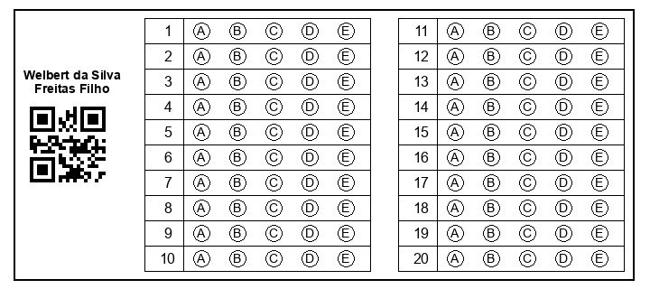
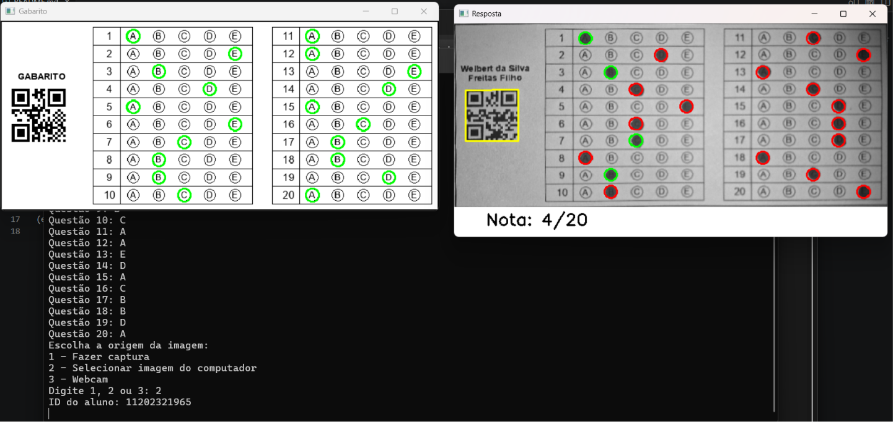
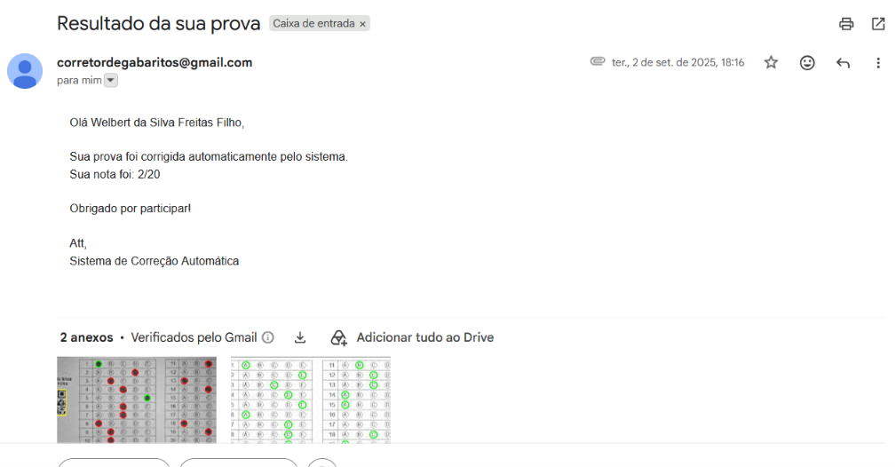

# 📄 CorretorGabarito

**Correção automática de gabaritos com visão computacional.**

Gere formulários de múltipla escolha com QR Code, corrija provas
automaticamente a partir de uma foto (webcam ou arquivo) e envie o resultado
por e-mail — tudo com Python e OpenCV.

> ⚠️ **Status: em desenvolvimento (Work in Progress).** A parte de visão
> computacional (geração e correção de gabaritos) está funcional. Um
> backend/frontend web para substituir a interação via terminal ainda está
> planejado — veja [`docs/ROADMAP.md`](docs/ROADMAP.md).

---

## Índice

- [Motivação](#motivação)
- [Funcionalidades](#funcionalidades)
- [Capturas de tela](#capturas-de-tela)
- [Tecnologias utilizadas](#tecnologias-utilizadas)
- [Arquitetura](#arquitetura)
- [Estrutura de pastas](#estrutura-de-pastas)
- [Como instalar](#como-instalar)
- [Como executar](#como-executar)
- [Configuração de e-mail](#configuração-de-e-mail)
- [Como contribuir](#como-contribuir)
- [Roadmap](#roadmap)
- [Status do projeto](#status-do-projeto)
- [Licença](#licença)

---

## Motivação

Correção manual de provas de múltipla escolha é demorada e sujeita a erros.
Este projeto nasceu como trabalho da disciplina de Visão Computacional
(UFABC) com o objetivo de automatizar esse processo: gerar formulários
identificados por QR Code, ler a folha de respostas de uma foto e calcular a
nota automaticamente — acelerando a correção e facilitando a devolução de
resultados aos alunos.

Todo o núcleo de visão computacional (geração de formulários, correção de
perspectiva, leitura de QR Code e detecção de marcações) foi desenvolvido
em **menos de um mês**, como parte do trabalho da disciplina. Isso explica
algumas das limitações e pontos de melhoria listados em
[`docs/ROADMAP.md`](docs/ROADMAP.md) — o foco do prazo original era validar
a técnica de visão computacional, não construir um produto completo.

## Funcionalidades

- 🧾 **Geração de formulários personalizados** — cria um formulário por
  aluno, com QR Code de identificação, a partir de uma lista simples de
  alunos. Exporta em PNG individual e em um único PDF pronto para impressão.
- 🎯 **Correção automática via visão computacional** — a partir de uma foto
  (webcam, captura assistida ou arquivo), o sistema:
  - Corrige a perspectiva da imagem, mesmo se fotografada em ângulo.
  - Identifica o aluno pelo QR Code.
  - Detecta quais alternativas foram marcadas.
  - Compara com o gabarito e calcula a nota.
- ✉️ **Envio automático de resultado por e-mail**, com a imagem corrigida e o
  gabarito anexados.
- 🛠️ **Ferramenta de calibração visual** (`comparacao.py`) para ajustar os
  parâmetros de filtro/binarização usados na detecção.

## Capturas de tela

> Substitua as imagens abaixo pelos seus próprios prints ao publicar o
> repositório — os arquivos já estão referenciados nos caminhos certos,
> basta salvar os prints com esses nomes dentro de `docs/screenshots/`.

| Formulário gerado | Prova corrigida | E-mail recebido |
|---|---|---|
|  |  |  |

Imagens de exemplo reais (usadas para testes de processamento, sem dados de
alunos) estão disponíveis em [`exemplos/`](exemplos/).

## Tecnologias utilizadas

- [Python 3](https://www.python.org/)
- [OpenCV](https://opencv.org/) — processamento de imagem e leitura de QR Code
- [NumPy](https://numpy.org/)
- [Pillow](https://python-pillow.org/) — geração das imagens dos formulários
- [ReportLab](https://www.reportlab.com/) — compilação dos formulários em PDF
- [qrcode](https://pypi.org/project/qrcode/) — geração dos QR Codes
- [python-dotenv](https://pypi.org/project/python-dotenv/) — carregamento de
  credenciais a partir de um arquivo `.env`
- `tkinter`, `smtplib`, `email` — bibliotecas padrão do Python, usadas para
  seleção de arquivo e envio de e-mail

## Arquitetura

O projeto é composto por três scripts Python independentes que compartilham
um arquivo `alunos.txt` como fonte de dados:

```
formularios.py  →  gera formulários com QR Code a partir de alunos.txt
comparacao.py   →  ferramenta de apoio para calibrar filtros de imagem
projeto.py      →  captura, corrige e envia o resultado por e-mail
```

Veja a descrição completa em [`docs/ARQUITETURA.md`](docs/ARQUITETURA.md) e o
detalhamento do algoritmo de correção em
[`docs/FUNCIONAMENTO.md`](docs/FUNCIONAMENTO.md).

## Estrutura de pastas

```
CorretorGabarito/
├── formularios.py          # Geração de formulários com QR Code
├── comparacao.py           # Calibração visual de filtros de imagem
├── projeto.py               # Captura, correção e envio de e-mail
├── alunos.txt                # Lista de alunos (id, nome, email, nota) — dados de exemplo
├── requirements.txt
├── .env.example               # Modelo de variáveis de ambiente (credenciais de e-mail)
├── .gitignore
├── exemplos/                   # Imagens de exemplo para comparacao.py
├── gabaritos/                   # Templates em branco do formulário (por nº de questões)
├── docs/
│   ├── ARQUITETURA.md
│   ├── FUNCIONAMENTO.md
│   ├── ROADMAP.md
│   └── apresentacao.pdf         # Slides originais do projeto acadêmico
├── formularios_gerados/          # Saída de formularios.py (gerado, não versionado)
└── provas_corrigidas/             # Saída de projeto.py (gerado, não versionado)
```

## Como instalar

1. Clone o repositório:

   ```bash
   git clone https://github.com/SEU_USUARIO/CorretorGabarito.git
   cd CorretorGabarito
   ```

2. (Recomendado) Crie um ambiente virtual:

   ```bash
   python -m venv venv
   source venv/bin/activate  # Windows: venv\Scripts\activate
   ```

3. Instale as dependências:

   ```bash
   pip install -r requirements.txt
   ```

   > `tkinter`, `smtplib` e `email` já vêm com o Python — não precisam ser
   > instalados via pip. Em algumas distribuições Linux, `tkinter` precisa
   > ser instalado separadamente pelo gerenciador de pacotes do sistema
   > (ex.: `sudo apt install python3-tk`).

## Como executar

### 1. Gerar os formulários

Preencha `alunos.txt` com os alunos reais (formato `id,nome,email`, uma
linha por aluno — veja o arquivo de exemplo incluído) e execute:

```bash
python formularios.py
```

Informe o número de questões quando solicitado. Os formulários serão
gerados em `formularios_gerados/` (PNGs individuais + um PDF único, pronto
para impressão).

### 2. Corrigir as provas

```bash
python projeto.py
```

Informe o número de questões e o gabarito (resposta correta de cada
questão). Em seguida, escolha a origem da imagem (captura via webcam, arquivo
ou webcam contínua). Pressione **espaço** para capturar (quando aplicável),
**Enter** para confirmar a correção exibida e salvar/enviar o resultado, e
**Esc** para encerrar.

### 3. (Opcional) Calibrar filtros de imagem

```bash
python comparacao.py
```

Útil se você alterar a qualidade/iluminação típica das fotos e precisar
reajustar os limiares de binarização.

## Configuração de e-mail

O envio de resultados usa uma conta Gmail com **senha de app** (não a senha
normal da conta):

1. Copie `.env.example` para `.env`.
2. Gere uma senha de app em <https://myaccount.google.com/apppasswords>
   (requer verificação em duas etapas ativada na conta).
3. Preencha `EMAIL_REMETENTE` e `EMAIL_SENHA_APP` no `.env`.

O arquivo `.env` nunca deve ser commitado — ele já está listado no
`.gitignore`.

## Como contribuir

Contribuições são bem-vindas! Veja o guia completo em
[`CONTRIBUTING.md`](CONTRIBUTING.md) e o [`CODE_OF_CONDUCT.md`](CODE_OF_CONDUCT.md).

Resumo rápido:

1. Faça um fork e crie uma branch (`feature/...` ou `fix/...`).
2. Faça suas alterações mantendo o estilo do projeto.
3. Abra um Pull Request descrevendo a mudança.

## Roadmap

Principais itens planejados (lista completa em
[`docs/ROADMAP.md`](docs/ROADMAP.md)):

- [ ] Backend web para cadastro de alunos/gabaritos sem editar arquivos manualmente.
- [ ] Frontend web integrado ao backend.
- [ ] Testes automatizados.
- [ ] Detecção dinâmica das bolhas de resposta (hoje usa coordenadas fixas).
- [ ] Configuração do índice da webcam sem editar o código.

## Status do projeto

🚧 **Em desenvolvimento.** O núcleo de visão computacional (geração de
formulários e correção automática) está funcional e é utilizável hoje via
terminal. O backend/frontend web ainda estão em planejamento.

Vale reforçar: essa base foi construída em menos de um mês como projeto da
disciplina de Visão Computacional (UFABC) — o repositório público é uma
continuação desse trabalho acadêmico, não uma reescrita do zero.

Veja o histórico de mudanças em [`CHANGELOG.md`](CHANGELOG.md).

## Licença

Distribuído sob a licença MIT. Veja [`LICENSE`](LICENSE) para mais detalhes.

---

Projeto desenvolvido originalmente por **Welbert da Silva Freitas Filho**
para a disciplina de Visão Computacional (UFABC), sob orientação do Prof.
Luiz Antonio Celiberto Junior. Os slides de apresentação originais estão
disponíveis em [`docs/apresentacao.pdf`](docs/apresentacao.pdf).
